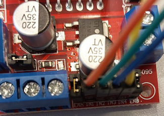

# A - Álgebra Booleana e Implementação de Funções Lógicas com CIs

| Data da entrega| 
|----------------|
| {{apsA_date}} |

Nesse projeto iremos utilizar a álgebra booleana para obter as funções lógicas de um sistema as quais deverão ser implementadas utilizando CIs.

Esse projeto deverá ser realizado em grupos de 4 integrantes e os arquivos devem ser enviados pelo Blackboard (é necessário que apenas um(a) integrante do grupo envie, desde que identifique os demais membros).

Queremos controlar o robô da figura a seguir:

{width=400}

onde y1 e y2 são sinais de saída (de 2 bits cada) para os motores que controlam as esteiras da esquerda e direita. x1, x2, x3 e x4 são sensores (bumpers) para detectar a colisão do robô.

Os sinais de y1 e y2 (de 2 bits cada) descrevem os seguintes movimentos:

- "01" - motor ligado diretamente (andando para frente)
- "10" - motor ligado reversamente (andando para trás) 
- "00" - motor desligado

> **os sinais y1 e y2 devem ser ligados as entradas I1, I2, I3 e I4 da ponte H.**

{width=400}

| **Rubricas do Projeto de Controle do Robô Utilizando Álgebra Booleana e CIs**  |
|--------------------------------------------------------------------------------|
| **A+**                                                                         |
| - **Implementação no Robô das Funções Lógicas:** As funções lógicas a seguir foram  implementadas com sucesso usando Circuitos Integrados (CIs) no protoboard:
|   1. Todos os motores desligados se (x1 e x2) e (x3 e x4) indicarem colisão.
|   2. Todos os motores desligados se nenhum sensor indicar colisão.
|   3. Ambos os motores ligados reversamente se os sensores (x1 e x2) detectarem colisão.
|   4. Ambos os motores ligados diretamente se os sensores (x3 e x4) detectarem colisão.
|   5. Motor esquerdo (y1) ligado e motor direito (y2) desligado para rotação horária quando x1 e/ou x3 detectarem colisão, mas não x2.
|   6. Motor esquerdo (y1) desligado e motor direito (y2) ligado para rotação anti-horária quando x2 e/ou x4 detectarem colisão, mas não x1.
|   7. Todos os motores desligados se todos os sensores detectarem objeto.
| - **Testes Bem-Sucedidos e Comportamento Adequado:** As funções lógicas foram testadas no robô real e demonstraram um controle preciso do carrinho. O robô reagiu conforme as situações especificadas, mostrando movimentos de avanço, ré e rotação conforme as condições dos sensores.
| - **Vídeo de Demonstração Abrangente:** O grupo forneceu um vídeo detalhado que mostra a montagem dos CIs no protoboard, a conexão com os sensores, a interação das funções lógicas com os sinais dos sensores e como o robô respondeu a diferentes cenários. O vídeo destacou a funcionalidade e a coerência do sistema implementado. |
|                                                                                 |
| **B+**                                                                          |
| - **Implementação em Simulador das Funções Lógicas:** As funções lógicas a seguir foram derivadas dos requisitos do projeto e implementadas de forma precisa usando um simulador de circuitos, como o Falstad ou o Tinkercad:
|   1. Todos os motores desligados se (x1 e x2) e (x3 e x4) indicarem colisão.
|   2. Todos os motores desligados se nenhum sensor indicar colisão.
|   3. Ambos os motores ligados reversamente se os sensores (x1 e x2) detectarem colisão.
|   4. Ambos os motores ligados diretamente se os sensores (x3 e x4) detectarem colisão.
|   5. Motor esquerdo (y1) ligado e motor direito (y2) desligado para rotação horária quando x1 e/ou x3 detectarem colisão, mas não x2.
|   6. Motor esquerdo (y1) desligado e motor direito (y2) ligado para rotação anti-horária quando x2 e/ou x4 detectarem colisão, mas não x1.
|   7. Todos os motores desligados se todos os sensores detectarem objeto.
| - **Testes Simulados Efetivos:** As funções lógicas foram testadas no simulador, e o comportamento foi conforme o esperado. A simulação mostrou que os motores simulados reagem corretamente às diferentes combinações de entrada dos sensores, evidenciando a correta implementação das funções.
| - **Vídeo ou Arquivo de Simulação Explicativo:** O grupo forneceu um vídeo explicativo ou um arquivo de texto que detalha a simulação das funções lógicas, incluindo a representação dos circuitos e os resultados observados em diferentes cenários. |
|                                                                                 |
| **C+**                                                                          |
| - **Obtenção, Simplificação e Aplicação das Funções Lógicas:** As funções lógicas a seguir foram obtidas corretamente a partir dos requisitos do projeto e simplificadas usando técnicas de álgebra booleana:
|   1. Todos os motores desligados se (x1 e x2) e (x3 e x4) indicarem colisão.
|   2. Todos os motores desligados se nenhum sensor indicar colisão.
|   3. Ambos os motores ligados reversamente se os sensores (x1 e x2) detectarem colisão.
|   4. Ambos os motores ligados diretamente se os sensores (x3 e x4) detectarem colisão.
|   5. Motor esquerdo (y1) ligado e motor direito (y2) desligado para rotação horária quando x1 e/ou x3 detectarem colisão, mas não x2.
|   6. Motor esquerdo (y1) desligado e motor direito (y2) ligado para rotação anti-horária quando x2 e/ou x4 detectarem colisão, mas não x1.
|   7. Todos os motores desligados se todos os sensores detectarem objeto.
| - **Resolução das Funções Lógicas:** O grupo forneceu uma foto clara da resolução escrita das funções lógicas obtidas e simplificadas, demonstrando a aplicação dos conceitos de álgebra booleana. |
|                                                                                 |
| **D**                                                                           |
| - **Obtenção sem Simplificação das Funções Lógicas:** As funções lógicas a seguir foram obtidas a partir dos requisitos do projeto, mas não foram simplificadas usando álgebra booleana.
| - **Apresentação Pouco Clara das Funções Lógicas:** A apresentação das funções lógicas e sua relação com as condições do projeto pode estar confusa ou pouco clara, dificultando a compreensão. |
|                                                                                |
| **I (Insatisfatório)**                                                         |
| - **Funções Lógicas Não Obtidas:** O grupo não conseguiu derivar as funções lógicas necessárias para o controle do motor com base nos requisitos do projeto.
| - **Falta de Implementação/Simulação:** Não há evidência de tentativa de implementação física com CIs ou de simulação das funções lógicas. |
