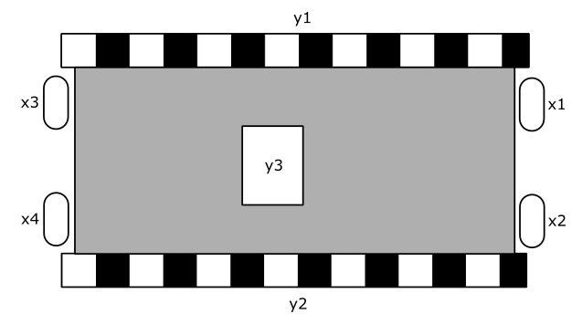

# A - Álgebra Booleana e Implementação de Funções Lógicas com Transistores e CI

| Data da entrega| 
|----------------|
| Quarta - 01/03 |

Nesse projeto iremos utilizar a álgebra booleana para obter as funções lógicas de um sistema as quais deverão ser implementadas utilizando transistores.

Esse projeto deverá ser realizado em duplas ou trios e os arquivos devem ser enviados pelo Forms.

Queremos controlar o robô da figura a seguir:

{width=400}

onde y1 e y2 são sinais de saída dos motores que controlam as esteiras da esquerda e direita e y3 é uma ponte H para controlar a direção do robô. x1, x2, x3 e x4 são sensores (bumpers) para detectar a colisão do robô.

Os sinais de y1 e y2 descrevem os seguintes movimentos:

- "0" - motor desigado
- "1" - motor ligado 

O sinal y3 controla a direção do movimento:

- "0" - diretamente (andando para frente)
- "1" - reversamente (andando para trás) 

O controle deve ser feito da seguinte forma:

1. O motor esquerdo (y1) deverá ser desligado e o motor direito (y2) ligado reversamente, sempre que uma colisão for detectada em x2, mas não em x1.
2. O motor esquerdo (y1) deverá ser ligado reversamente e o motor direito (y2) desligado, sempre que uma colisão for detectada em x1, mas não em x2.
3. O motor esquerdo (y1) deverá ser desligado e o motor direito (y2) ligado diretamente, sempre que uma colisão for detectada em x4, mas não em x3.
4. O motor esquerdo (y1) deverá ser ligado diretamente e o motor direito (y2) desligado, sempre que uma colisão for detectada em x3, mas não em x4.
5. Ambos os motores devem ser ligados reversamente se os sensores x1 e x2 detectarem colisão.
6. Ambos os motores devem ser ligados diretamente se os sensores x3 e x4 detectarem colisão.
7. Todos os motores devem ser ligados diretamente se nenhum sensor indicar colisão.
8. Todos os motores devem ser desligados se (x1 ou x2) indicar colisão juntamente com (x3 ou x4).

-> Caso alguma condição lógica esteja presente em mais de uma instrução, considerar a primeira condição que ocorre!

<!--
1. O motor esquerdo (y1) deverá ser ligado e o motor direito (y2) desligado, permitindo que o robô rotacione em sentido horário, sempre que um objeto for detectado em x1 e/ou x3, mas não em x2.
1. O motor esquerdo (y1) deverá ser desligado e o motor direito (y2) ligado, permitindo que o robô rotacione em sentido anti-horário, sempre que um objeto for detectado em x2 e/ou x3, mas não em x1.
1. Ambos os motores devem ser ligados se nenhum dos sensores detectar um objeto ou se x1 e x2 detectarem o objeto.
1. Todos os motores devem ser desligados se os três sensores detectarem um objeto.
-> Caso alguma condição lógica esteja presente em mais de uma instrução, considerar a primeira condição que ocorre!
-->

## Atenção

1. y1 e y2 devem ser implementadas com CIs (74xx)
2. y3 deve ser implmentada com transistores MOS (4007)

## Rubricas

| Conceito | Descritivo                                                  |
|----------|-------------------------------------------------------------|
| **A+**   | Funções lógicas implementadas com transistores no protoboard                     |
|          | Anexar video no repositório da atividade                    |
| **B+**   | Funções lógicas implementadas com transistores no simulador falstad ou tinkercad |
|          | Anexar video e/ou o arquivo texto da simulação no repositório da atividade       |
| **C+**   | Funções lógicas obtidas e simplificadas                     |
|          | Anexar foto da resolução                                    |
| **D**    | Funções lógicas obtidas mas não simplificadas               |
| **I**    | Funções lógicas não obtidas                                 |
